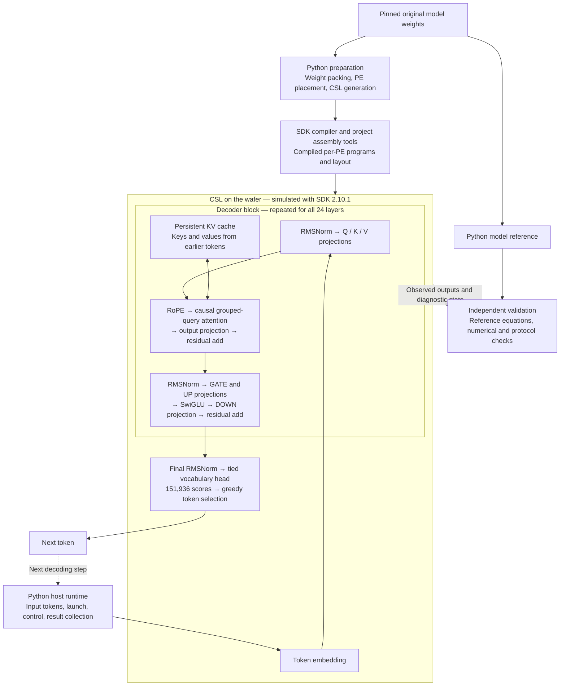

# CSL-LLM

**A research implementation of a complete language model in Cerebras Software Language (CSL), with distributed operators and explicit communication across a wafer-scale processor.** The target is **Qwen2.5-0.5B-Instruct** on **Cerebras WSE-3**, using SDK **2.10.1**, original model weights, all **24 decoder layers**, and the full **151,936-token vocabulary**.

The research question is how to place the model's weights, computation and persistent attention state in distributed on-chip memory, connect those computations through the wafer's communication fabric, and verify the resulting program against independent model references. A **PE** is one processing element with its own local memory; the complete static assembly occupies **193 × 210 = 40,530 PEs**.

**Current state: development paused, awaiting physical hardware experiments.** All 24 layers have been statically assembled; a two-layer chain and the complete vocabulary head have separately passed SDK numerical tests. **No complete-model first output token has been verified.** “Temporarily development complete” records the user's decision to stop simulation, not a claim of end-to-end correctness. [Pause and handoff](docs/PROJECT-PAUSE.md).

## 1. Project design

The diagram describes the intended complete inference path. Its components have different validation levels, listed below; the entire path has not passed end-to-end execution.

**CSL performs the device computation and communication.** Matrix blocks reside on PEs; CSL kernels implement the projections, normalization, attention, nonlinearities and reductions. Distributed runtime code handles routing, completion and persistent state. In the accepted two-layer test, intermediate values pass between layers on the device; Python does not calculate the second layer on its behalf.

**Python builds, drives and checks the program.** It packs weights, plans placement, generates deployment sources, orchestrates compilation and assembly, launches SDK experiments, and compares actual outputs with independent references. Python reference inference is a separate validation tool. This repository builds on Pragma HLS experience, but its current model implementation is handwritten/generated CSL with Python tooling, not a general HLS-to-CSL model compiler.

The model uses hidden width **896**, MLP width **4,864**, **14 query heads / 2 KV heads**, and BF16 weights with FP32 accumulation in the validated linear paths. Batch size **1**, total context **2,048**, and up to **256 generated tokens** are design targets; the full-model capacity has not been demonstrated.

### What has actually been established?

| Scope | Evidence today |
| --- | --- |
| Full 24-layer deployment | All **34,552 original matrix blocks** covered across 35 static partitions and assembled into the complete PE layout; program identity and interfaces checked. **Static acceptance.** |
| Decoder integration | Original **layer 0 → layer 1**, first position, cached next position and reset, in one SDK instance; **52 independent numerical checks** and bit-exact reset repeat. **SDK numerical acceptance at two layers.** |
| Full vocabulary module | All **151,936 scores** checked in three isolated SDK cases using original weights. **SDK numerical acceptance for this module.** |
| Whole-model execution | First attempt reached a **six-hour timeout** with readiness only. A later diagnostic exported a core, but its neural state was not numerically accepted. **No verified first token or continuous generation.** |
| Physical hardware | **Not tested.** Simulator timings are not hardware performance measurements. |

## 2. Where to find the code and evidence

| Directory | What it contains | When to read it |
| --- | --- | --- |
| [`csl/kernels/`](csl/kernels/) | Reusable CSL arithmetic operators and their contracts. | Understand the device computations. |
| [`csl/runtime/`](csl/runtime/) | CSL communication, distributed execution and state/control components. | Understand how PEs cooperate. |
| [`src/csl_llm/`](src/csl_llm/) | Python placement and region-contract machinery. | Understand how a model becomes a PE layout. |
| [`tools/`](tools/) | Python preparation, compiler/assembly drivers, SDK experiments and reference checks. | Follow the build and validation workflow. |
| [`support/`](support/) | Isolated helper versions for model assembly, model boot, partitions, two-layer tests and core export; some include CSL. | Find the exact dependency set used by a specific milestone. |
| [`configs/`](configs/) | Model identity, precision policy and reference inputs. | Identify precisely which model and assumptions are being tested. |
| [`tests/`](tests/) | Host-side tests for tooling and contracts. | Check Python-side behavior; these are not device execution evidence. |
| [`validation/frozen/`](validation/frozen/) | Selected historical drivers, CSL sources, manifests and compact run records. | Inspect the version associated with a recorded experiment. |
| [`validation/reviews/`](validation/reviews/) | Independent acceptance and outcome reviews. | Verify whether a result was numerical, static, diagnostic or unsuccessful. |
| [`evidence/`](evidence/) | Small published model/reference metadata. | Trace reference provenance without downloading model weights. |
| [`docs/`](docs/) | Design contracts, milestone explanations, source maps and reproduction limits. | Read the detailed account behind a log entry. |
| [`release/`](release/) | Publication checks, project state and file-hash manifest. | Audit this public package and distinguish it from original experiment artifacts. |

**Start with a log entry, follow its source map, then inspect the corresponding frozen inputs and independent review.** CSL source is also preserved in milestone-specific `support/` and `validation/frozen/` directories; it is not all under the top-level `csl/` directory. Multiple historical helper versions are intentional: later changes must not silently replace the code behind an earlier accepted result.

## 3. Development and experiment log — newest first

Dates below are **publication dates** in Git history, not necessarily the date an experiment finished. Related small updates are grouped; links lead to the source map, original run identities, independent reviews and limitations. Failed experiments are retained because they define what remains unverified.

**Evidence labels:** **SDK** = actual simulator output independently checked within the stated scope; **Static** = compilation/artifact checks without inference; **CPU** = reference computation; **Source** = implementation or host checks only; **Diagnostic** = saved state or protocol evidence, not model inference.

| Published | Work completed or outcome recorded | Evidence and limits |
| --- | --- | --- |
| 2026-09-09 | **Development paused; final full-model diagnostic retained.** All 40,530 ready flags checked; a 2.25 GB core exported; tracked processes exited. | **Diagnostic / stop timeout.** Core neural values remain unaccepted; no qualified restart checkpoint. [Handoff](docs/PROJECT-PAUSE.md) |
| 2026-09-09 | **Runtime state export qualified on two PEs.** Normal and unfinished computation/communication snapshots checked independently. The first full-model six-hour failure was also documented. | **Diagnostic.** Active snapshots pass their checks, while shutdown still times out. Full-model failure produced no verified neural output. [Source and results](docs/SDK-CORE-EXPORT.md) |
| 2026-09-09 | **Complete original-model assembly.** All 34,552 matrix blocks composed into the 193 × 210 layout; 408,684 symbol/coordinate checks. | **Static.** Exact compiled-program and interface checks; no inference pass. [Assembly](docs/FULL-MODEL-ASSEMBLY.md) |
| 2026-09-09 | **All 35 original-weight partitions completed.** Repeated compilation and initializer audits culminated in complete matrix-block coverage. | **Static.** The full coverage ledger preserves every interval and its evidence. [Partitions](docs/MODEL-PARTITIONS.md) |
| 2026-09-08 | **Full-model execution tooling prepared.** Exception-safe cleanup and guarded generation preparation added alongside further static partitions. | **Source.** Host checks and reviewed preparation do not establish full-model execution. [Tooling](docs/MODEL-VALIDATION-PREPARATION.md) |
| 2026-09-08 | **Full 24-layer single-token reference checked.** 459 independent reference checks completed. | **CPU.** This result is separate from CSL execution. [Reference evidence](docs/MODEL-VALIDATION-PREPARATION.md) |
| 2026-09-08 | **Two-layer cached decoding and reset validated.** Original layer 0 → layer 1, positions 0 and 1, then reset to position 0. | **SDK.** One persistent instance, 52 numerical checks, bit-exact reset outputs. [Cached chain](docs/TWO-LAYER-CACHED.md) |
| 2026-09-08 | **First original-weight two-layer chain validated.** 2,088 original matrix blocks connected with device-side intermediates. | **SDK.** Bounded first-position integration, preceding the cached/reset extension. [Two-layer chain](docs/TWO-LAYER.md) |
| 2026-09-08 | **Full-layout boot validated.** Initialization, reset and preparation across 40,530 PE coordinates. | **SDK readiness only.** This early boot fixture had only 12 original-weight matrix blocks; it did not execute model inference. [Boot](docs/MODEL-BOOT.md) |
| 2026-09-08 | **Complete vocabulary head validated.** 9,496 original weight blocks; all scores, selected embedding rows, tie behavior and repeat checked. | **SDK.** Three isolated cases, not the output of a complete 24-layer chain. [Vocabulary](docs/FULL-VOCABULARY.md) |
| 2026-09-08 | **Large-grid output transport validated.** Tagged streaming output across a 193 × 50 grid. | **SDK transport.** Diagnostic integer payloads and completion counts, not model scores. [Transport](docs/STREAM-OUTPUT.md) |
| 2026-09-08 | **Cross-partition execution validated.** Eight-PE reduction for a 128 × 896 contraction, following a two-PE compiled-artifact comparison. | **SDK.** Actual outputs compared with direct execution and independent numerics. [Composition](docs/PARTITION-EXPERIMENT.md) |
| 2026-09-08 | **Native byte-packed static weights validated on one PE.** Complete weight readback and four GEMV cases. | **SDK at one tile.** Larger initializer experiments had separate compile-only scope. [Static weights](docs/NATIVE-U8.md) |
| 2026-09-08 | **Full-vocabulary compilation limit recorded.** An early attempt hit its 24 GiB memory guard. | **Failed compilation.** No numerical output; later vocabulary acceptance above supersedes the implementation limitation. [Failure history](docs/NATIVE-U8.md) |
| 2026-09-08 | **Complete decoder layer 0 validated.** Causal attention, KV state, both normalization/residual paths and the MLP, over five calls. | **SDK.** Full single-layer behavior within a bounded sequence. [Decoder](docs/DECODER.md) |
| 2026-09-08 | **Resident MLP optimized.** A DSD-copy variant preserved outputs while reducing the measured controller interval by 49.57% in nonzero cases. | **SDK comparison.** Simulator cycle interval, not whole-model or hardware speedup. [Comparison](docs/RESIDENT-MLP.md) |
| 2026-09-08 | **Resident MLP composed and validated.** UP, GATE, SwiGLU and DOWN connected on device across 916 weight tiles. | **SDK.** Four checked cases; normalization/residual added in the later decoder milestone. [MLP](docs/RESIDENT-MLP.md) |
| 2026-09-08 | **Full layer-0 projections validated separately.** DOWN (896 × 4,864), GATE and UP (4,864 × 896), across 308/304/304 PEs. | **SDK.** Four cases per projection, before device-side MLP composition. [Projection records](docs/MILESTONES.md) |
| 2026-09-08 | **Attention, cache and communication foundations validated.** Stateful GQA with 34 reference tokens, a separate 2,048-position KV diagnostic, packet acknowledgments and full-checkpoint BF16 packing. | **SDK components + host packing checks.** The cache diagnostic is not 2,048-token full-model generation. [Milestones](docs/MILESTONES.md) |
| 2026-09-08 | **Initial operator library and reference baseline released.** Linear algebra, regional communication, normalization, residual, SwiGLU, softmax, RoPE and model references. | **Bounded component tests.** Starting point for the integrations above. [Operator contracts](csl/kernels/README.md) · [Validation guide](validation/README.md) |

For individual publication changes, see the [complete commit history](https://github.com/lingzhi227/csl-llm/commits/main/). Original acceptance rules are in [ACCEPTANCE.md](docs/ACCEPTANCE.md).

## Reproduction and scope

This is a curated research source and evidence release. It excludes model weights, generated weight literals, SDK binaries, compiled device programs, raw tensors and core dumps. Frozen manifests may describe omitted artifacts; their directories are inspection records, not self-contained runnable bundles. Public host-path adaptations have not received a fresh SDK qualification.

See [setup and reproduction](docs/REPRODUCING.md), [publication checks](release/CHECKS.md), and [source attribution and licenses](THIRD_PARTY_NOTICES.md). Obtain the pinned model and an appropriate SDK separately before preparing new experiments. Development and simulation remain paused until a new user instruction.
